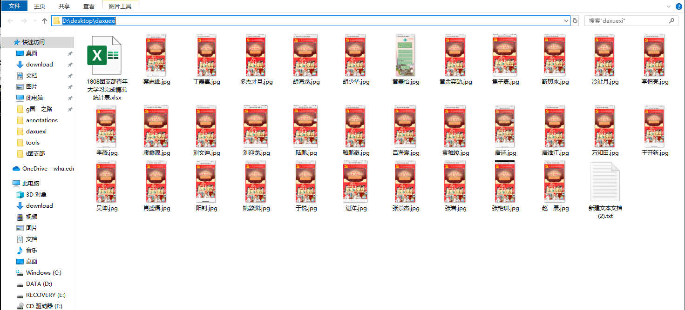
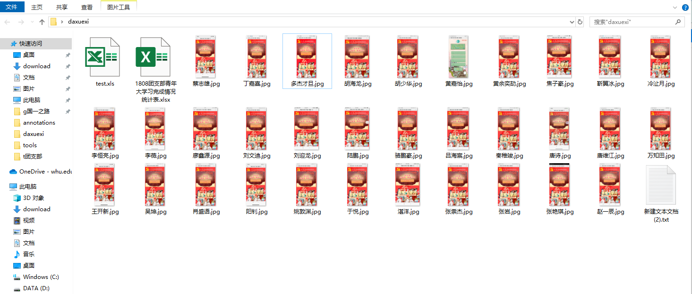
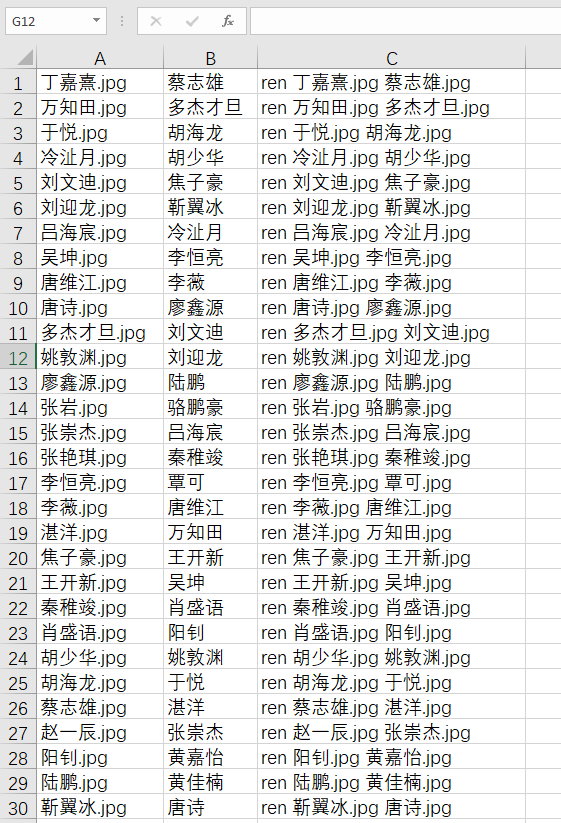
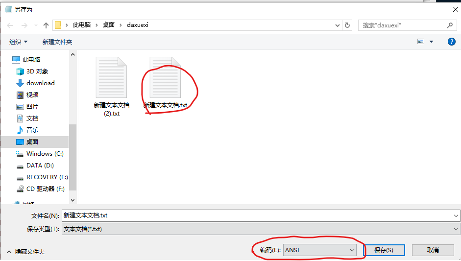

### 生成所有文件的名称

1. wim+R打开”运行“窗口，输入cmd并回车，进入控制台。

2. 输入：

   **dir D:\desktop\daxuexi /b > D:\desktop\daxuexi\test.xls**

   前面的路径是要获取文件名的这些文件所在的父集目录，后面的路径是生成的文件名表格，不一定要和图片在图一个文件夹。

   运行命令前：

   

    运行命令后：

    

### 制作批处理文件

1. 打开test.xls文件，出现是否打开文件的提示点“是”

2. 删除不是图片名称的单元格

3. 在新的一列粘贴同学的姓名

4. 在新的一列输入公式：**="ren "&a1&" "&b1&".jpg"**，回车后单元格会显示ren xx.jpg yy.jpg，这是重命名文件的命令。注意所有符号均为英文符号

5. 自动填充

   

6. 将c1列的内容复制，粘贴到文本文件中。文本文件需要和图片在同一个文件夹中

7. 另存为文本文件时注意设置编码为“**ANSI**”，双击原始文件直接替换掉它

   

8. 将文本文件的后缀名改为.bat，双击执行，杀毒软件报警时点允许

> [如何显示文件后缀名？](https://jingyan.baidu.com/article/f00622282564bdfbd3f0c827.html)

